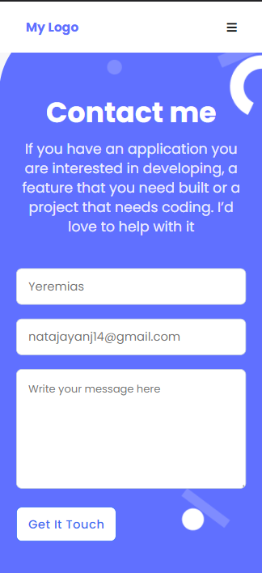
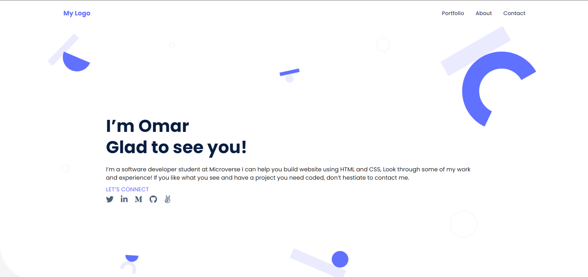
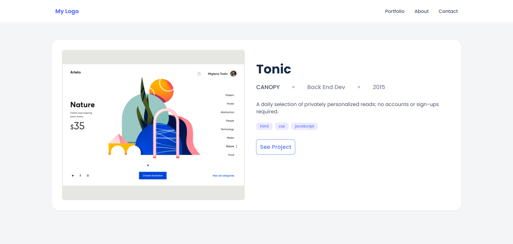
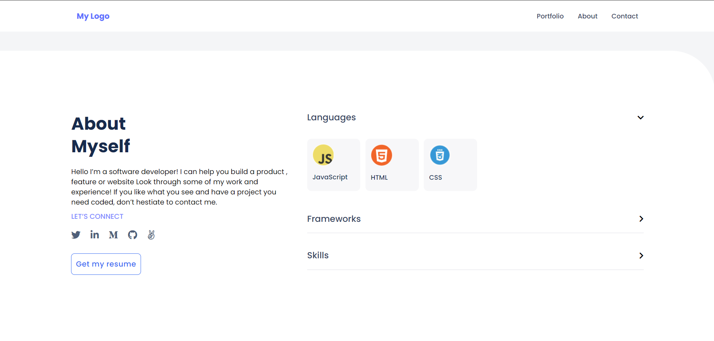
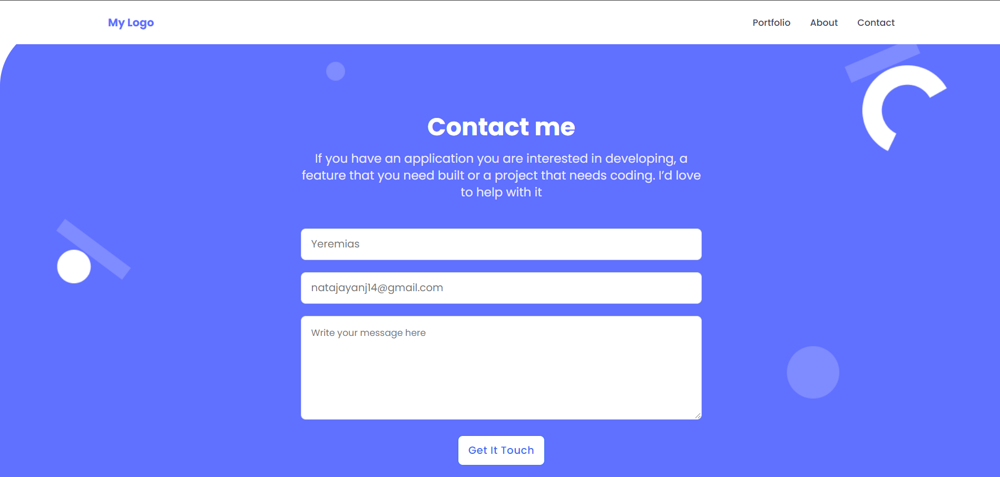

# Portfolio - Desktop Version

> This is my first try to make a portfolio:
  Previous project changes:
    1- Add logo and menu section.
    2- Add hero section.
    3- Add Works section.
    4- Add About me section.
    5- Add Contact form in footer.
    6- Edit it to fit mobile version.
    7- Edit it to fit Desktop Version.

# Portfolio - live Demo.
  https://omar-muhamad.github.io/Portfolio-Full-Vesion/ 

# Screenshots from mobile version.

    
  
    

  

# Screenshots from Desktop version.

  
  
  
  
  

## Built With

- HTML
- CSS

## Authors

👤 **Omar-Muhammad**

- GitHub: [@githubhandle](https://github.com/Omar-Muhamad)
- Twitter: [@twitterhandle](https://twitter.com/Eng_OmarMuhamad)
- LinkedIn: [LinkedIn](https://www.linkedin.com/in/eng-omarmuhammad/)
