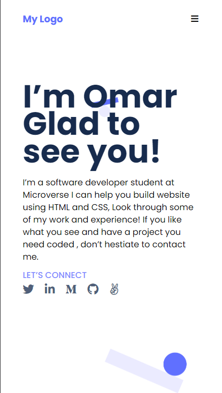
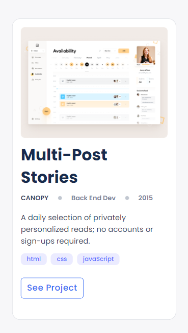
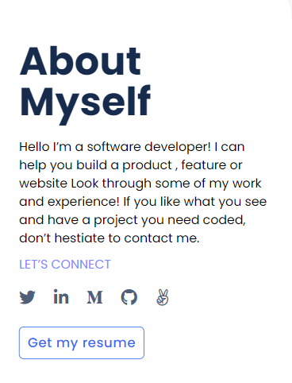
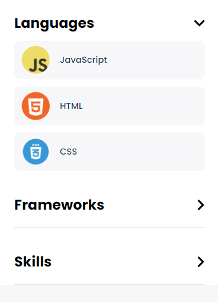

# Portfolio - Mobile Version

> This is my first try to make a portfolio:
  Previous project changes:
    1- Add logo and menu section.
    2- Add hero section.
    3- edit them to fit mobile version.

  
  
  New project changes:
    1- Add Works section
    2- Add About me section
    3- Edit them to fit mobile version

  

  

  

## Built With

- HTML
- CSS
- Linters

## Authors

👤 **Omar-Muhammad**

- GitHub: [@githubhandle](https://github.com/Omar-Muhamad)
- Twitter: [@twitterhandle](https://twitter.com/Eng_OmarMuhamad)
- LinkedIn: [LinkedIn](https://www.linkedin.com/in/eng-omarmuhammad/)
